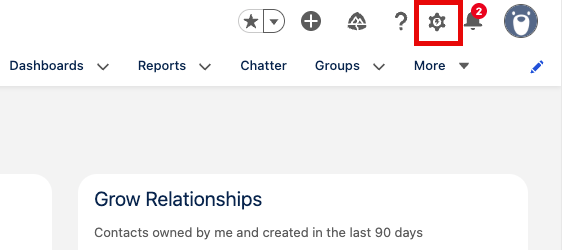
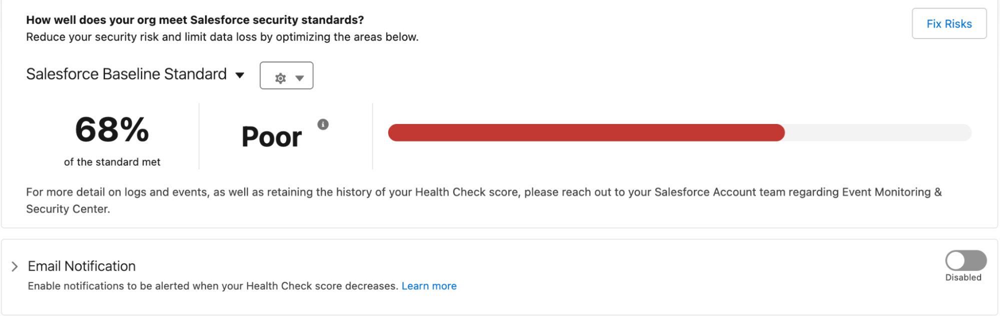

[← Data & Access Overview](02-data-and-access-overview.md) | [Project Home](../index.md) | [Exercise 2: Update Session Security →](04-exercise-2-update-session-security.md)

---

# Exercise 1: Health Check

### Scenario

Nearly 30% of data breaches are caused by misconfigured access settings. Health Check allows admins to take their org's security to the next level by setting these access levels, meet relevant industry compliance standards, and provide visibility via a Security Score to leadership to prove your org—and more importantly your data—is secure. In this exercise, you'll get familiar with Health Check and understand how to take action on critical security settings to increase your org's security score against the Salesforce Baseline Standard.

### Step 1: Access Health Check

1. From the Home Page, open Setup.

2. Type Health Check into the Quick Find
3. Select **Health Check**

### Step 2: Explore Health Check

Health Check is a dashboard in Setup that compares your org's security settings against a Security Baseline. It evaluates configuration such as password policies, session settings, identity, and network security to help you identify risks immediately and take action to better secure your org. You can see that our instance has several security issues to review and has a Poor security score:

1. Scroll through the page to review the Health Check results
   1. Review High-Risk Security Settings
   2. Medium-Risk Security Settings
   3. Low-Risk Security Settings
   4. Informational Security Settings
2. Take note of the Critical Status items and compare your org's value to the standard value

### Summary

With a Poor security score and several Critical status settings to review it can feel a bit daunting, but Health Check makes it easy to better secure your org by allowing you to update these settings quickly. In a few clicks, Health Check could automatically update these settings to improve your health score, but let's dig into some specific settings before letting Health Check do its magic.

#### Next: Update Session Security

---

[← Data & Access Overview](02-data-and-access-overview.md) | [Project Home](../index.md) | [Exercise 2: Update Session Security →](04-exercise-2-update-session-security.md)
