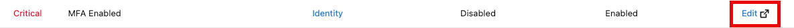
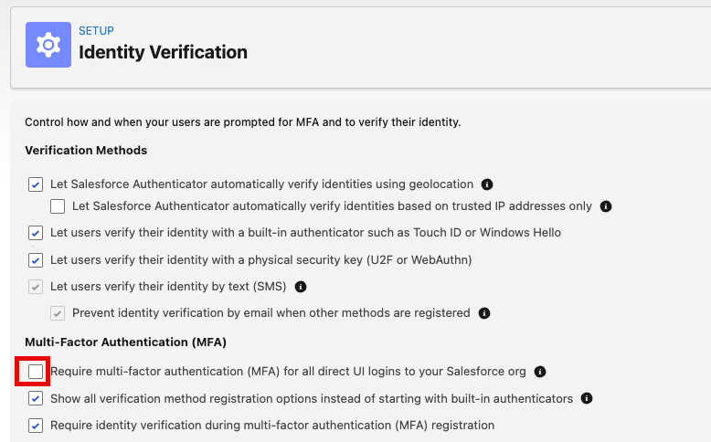
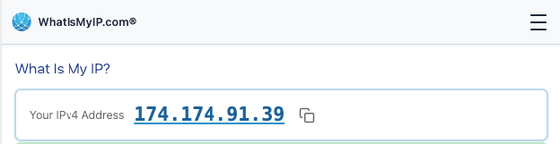
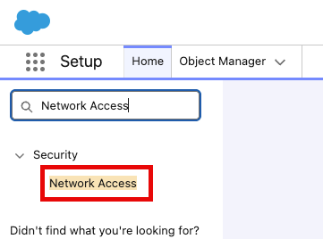
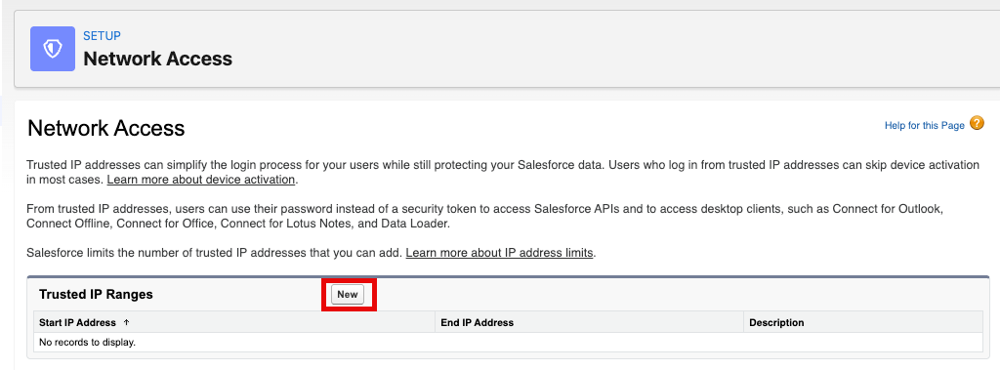
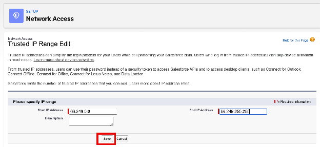
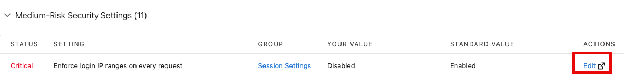
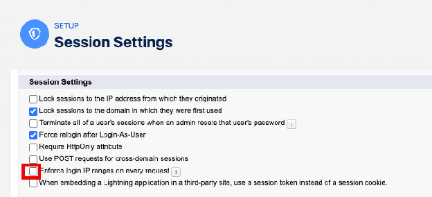

[← Exercise 1: Health Check](03-exercise-1-health-check.md) | [Project Home](../README.md) | [Exercise 3: User Security →](05-exercise-3-user-security.md)

---

# Exercise 2: Update Session Security

In this exercise, we will take action on critical security vulnerabilities to increase our org's security posture and Health Check security score.

### Scenario

You are the new Salesforce admin at an organization and while doing your first review of your new org's Health Check, you notice the poor security score and several non-compliant Security Settings. You decide to focus on the Critical Status items to better secure your org.

By the end of this chapter, you will have resolved 2 critical security issues:

* **MFA Enabled** - instead of just using a password to log in, users will also have to confirm their identity through a second step—like a notification on their phone or a code—to prove it's really them and keep hackers out. Salesforce is taking MFA security a step farther to better protect your org's most privileged accounts by enforcing phishing-resistant MFA for System Administrators and users with Modify All Data, View All Data, Customize Application, or Author Apex permissions.
* **Enforce login IP ranges on every request** - Salesforce doesn't just check user location when they first log in, but continues to verify that your users are still on a trusted network every single time they click a link or save a page, immediately cutting off access if they switch to an unapproved connection.

Both of these flaws are problematic for secured access to your organization.

### The Many Factors Of Security

The most basic concept of being able to access either a platform or an application is provisioned through the concept of three basic rules of security. This is something you know, something you have, and something you are.

#### 1. Something You Know (Knowledge Factor)

This is the most common and traditional form of security. It relies on information that exists only in your mind.

* **Examples:** Passwords, PINs, or the answer to a secret question
* **The Weakness:** This is the easiest factor to steal. Through phishing, social engineering, or data breaches, a "bad actor" can gain what you know without ever coming near you.

#### 2. Something You Have (Possession Factor)

This requires you to physically own or have access to a specific object.

* **Examples:** Your smartphone (for receiving a push notification or SMS), a physical security key (like a YubiKey), or a smart card.
* **The Strength:** Even if a hacker steals your password (what you know), they can't log in unless they also physically have your phone or key (what you have).

#### 3. Something You Are (Inherence Factor)

This is based on your unique physical biological characteristics. These are often referred to as **Biometrics**.

* **Examples:** Fingerprint scans, FaceID, or retina scans.
* **The Strength:** This is extremely difficult to replicate or steal. It ensures the person logging in is physically the same human being who owns the account.

### Step 1: Enable MFA

> **Tip:** Work with your IT and Security Teams to identify the best MFA solution for your organization. There are many to choose from!

1. Head to your Health Check High-Risk Security Settings and click **Edit** next to the *MFA Enabled* setting

2. In Identity Verification, check the box to Require multi-factor authentication (MFA) for all direct UI logins to your Salesforce org

3. Scroll down and **Save** your Identity Verification settings.
4. Return to your Health Check and refresh the page—your Security Score will increase

### Step 2: Set Login IP Ranges

Trusted IP Ranges allow you to have known ranges of login locations you would expect your users. Without trusted IP ranges, our org is currently unable to offer a specific path for authentication based on a user's login, and is unable to determine if a user is attempting to login from an unusual IP address.

> **Tip:** Normally you would reach out to your IT department to determine what ranges are secure for users. Today we'll use the internet to help us out.

1. Find your IP address to determine what ranges make sense for your users based on locations and VPN security.
2. Go to [What Is My IP?](https://www.whatismyip.com/)

3. Copy your IP address results
4. Go back to Salesforce and open **Setup**

5. Type *Network Access* into the Quick Find

6. Click **New**

7. Paste the IP range from your Google results and create a range for:
   `X.X.0.0` to `X.X.255.255`

> **Tip:** X.X is the first two numbers from your Google result. Now this is an exercise only for this workshop—it provides a **very broad concept of geographic logins.** It will allow you to add a trusted range for this exercise, but for your best results consult your IT department or Internet Service Provider on a reasonable range your users would use.

8. Click **Save**

### Step 3: Enforce Login IP Ranges on every request

1. Head back to Health Check and scroll down to Medium-Risk Security Settings. Click **Edit** next to the *Enforce login IP ranges on every request* setting

2. Scroll up to Session Settings
3. Check the box to Enforce login IP ranges on every request

4. Scroll down to **Save** your Session Settings
5. Return to your Health Check and refresh the page—your Security Score will increase

### Summary

You have taken action on Critical Session Settings identified in your Health Check. By enabling MFA, creating trusted IP login ranges, and enforcing login IP ranges on every request, you have taken the first steps to better protect your org from critical security threats.

> **Further Reading:** [Using the Audit Trail](10-further-reading-using-the-audit-trail.md)

#### Next: Dive into User Security

---

[← Exercise 1: Health Check](03-exercise-1-health-check.md) | [Project Home](../README.md) | [Exercise 3: User Security →](05-exercise-3-user-security.md)
