[← Exercise 2: Update Session Security](04-exercise-2-update-session-security.md) | [Project Home](../index.md) | [Exercise 4: Configure Health Check →](06-exercise-4-configure-health-check.md)

---

# Exercise 3: Dive into User Security

### Scenario

We've all been there: a user is in a rush to get data logged, hits a *Permission Denied* error, and suddenly it's an admin emergency. To avoid an influx of support tickets, a former admin decided to give every user *View All* and *Modify All* access. While the team is definitely working unhindered, the org is violating the Principle of Least Privilege. In this exercise, we're going to reel in that over-shared access and make sure users have exactly what they need to do their jobs—and absolutely nothing more.

**The Principle of Least Privilege**

The Principle of Least Privilege says users should only have the permissions they need to do their job, and nothing else. As admins, we often deal with permission creep and have seen scenarios where users have been granted increasingly broad access, often well beyond what their role requires. Users may not run into as many roadblocks with full access, but this creates many security and data concerns.

> **Further Reading:** [Understand the Security Hierarchy](11-further-reading-understand-the-security-hierarchy.md)

### Step 1: Troubleshoot with User Access Summaries

When working with a user, you notice he has more access than he needs to do his job and decide to troubleshoot using User Access Summaries. Let's take a look at James's access through View Summary on his User Record:

1. Click and open Setup

2. Type *Users* into the Quick Find

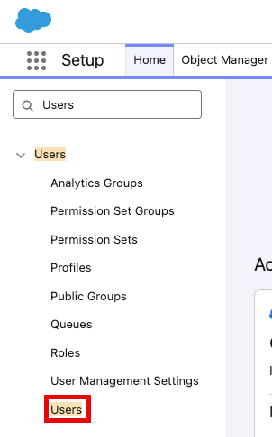

3. Click **Users**
4. Select James Doe

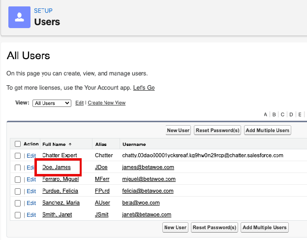

5. Click the **View Summary** button

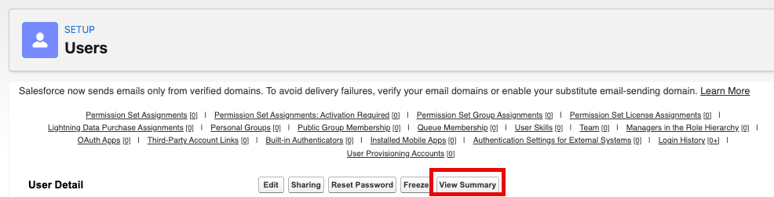

6. On the User Access Summary, select the **Object Permissions** tab. Here you can see that simply with the System Administrator profile, James Doe has the ability to read, Create, Edit, Delete, View All Records, and Modify All Records for all objects.

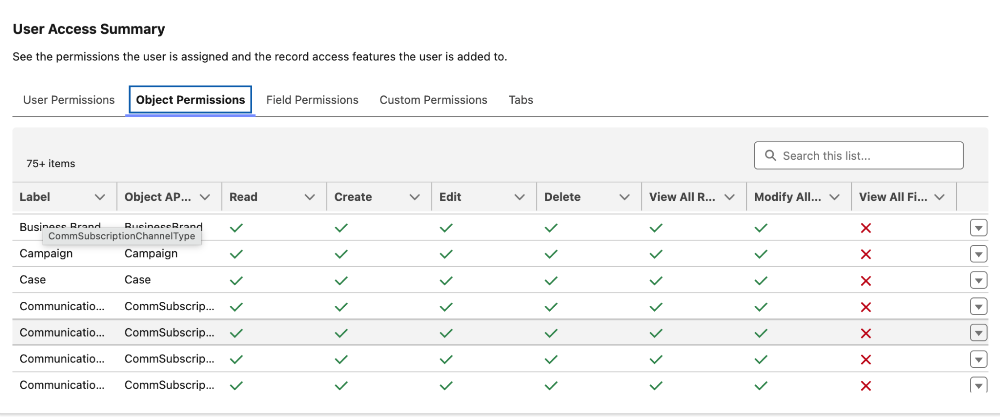

As a System Administrator, it makes some sense for your profile to have this much access. However, it seems that some users have been made System Administrators for convenience, not need, and violate the Principle of Least Privilege. Let's identify these over-permissioned users and update their user settings for tighter security.

### Step 2: Using Reports to Define Problem Users

In some orgs you may have hundreds of users, so to check for potentially problematic users it's easiest to run a report against the characteristics you are looking for. Here, we are going to be looking for active users with a System Administrator profile, even though they possibly don't need to be. Let's run the report and see what we find!

1. Open the App Launcher
2. Type *Reports* into the Search bar

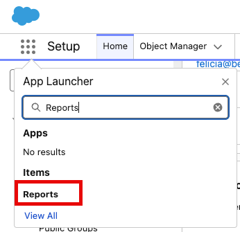

3. Click **Reports**
4. Click **Public Reports**

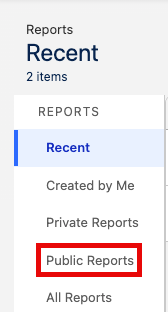

5. Type *Active System Admin* in the Search bar

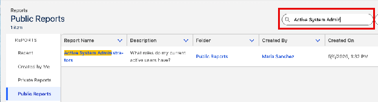

6. Click the **Active System Administrators** report to open and run the report

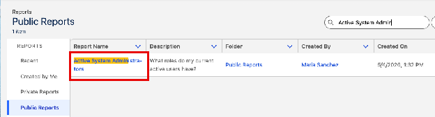

Your report should look similar to this:

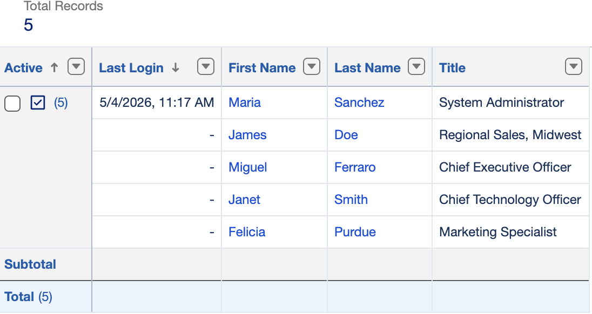

As you can see, we have 5 System Administrators even though you are the only Salesforce Administrator. This has also been flagged on your Health Check as an Informational Security Setting since the percentage of active internal users with System Administrator profile is higher than recommended.

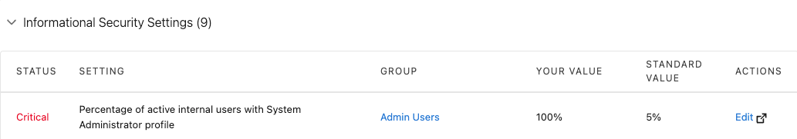

### Step 3: Remove System Administrator Profiles to Enforce the Principle of Least Privilege

1. Go back to Health Check and scroll down to *Informational Security Settings*
2. Click **Edit** next to *Percentage of active internal users with System Administrator profile*

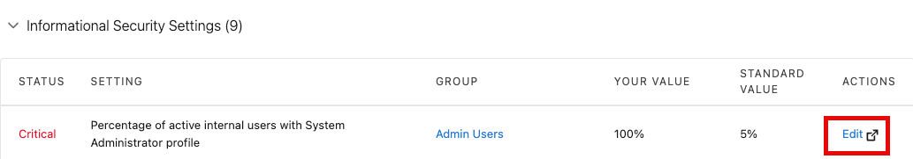

3. Click **Edit** next to user James Doe (Regional Sales)

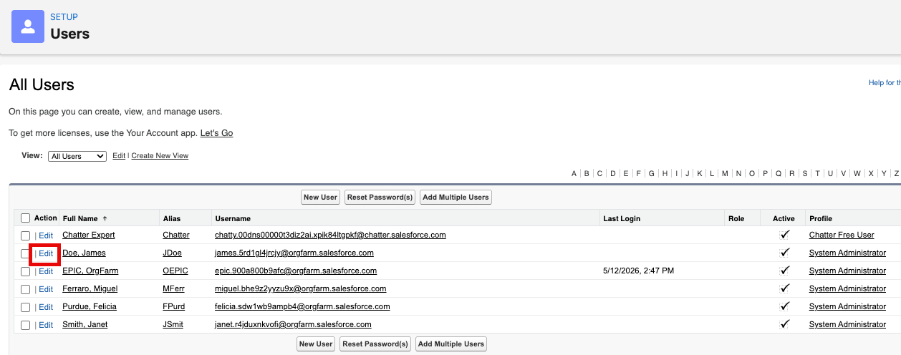

4. Select *Profile* and change the value from *System Administrator* to *Standard User*

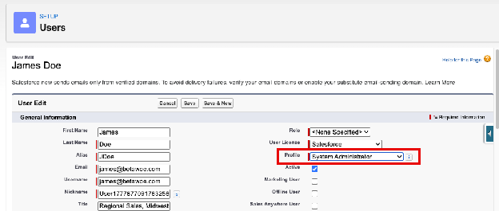

> **Tip:** Apply a permission set led security model that is scalable. Profiles set the minimum access for your users. For maximum restriction, you can use the Minimum Access - Salesforce profile as a baseline and add additional access using Permission Sets and Permission Set Groups.

### Summary

We have used User Access Summaries, Reports, and our Health Check as tools to uncover and update user settings to enforce the Principle of Least Privilege in our Salesforce instance. If we were to continue down this path beyond this workshop, our next steps to continue to refine User Management at our organization might be to move to a permission set led model that is scalable and secure. By shifting your mindset from profiles defining access to permission sets layering access, you'll build a system that's easier to maintain, easier to audit, and easier to adapt as your org grows. But now, let's head back to Health Check and continue to configure security settings for our org.

> **Further Reading:** [Session Based Problem Users and Reports to Find Them](12-further-reading-session-based-problem-users.md)

### Next: Configure Health Check

---

[← Exercise 2: Update Session Security](04-exercise-2-update-session-security.md) | [Project Home](../index.md) | [Exercise 4: Configure Health Check →](06-exercise-4-configure-health-check.md)

