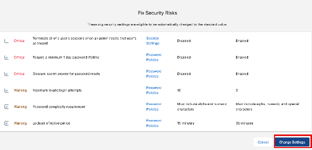
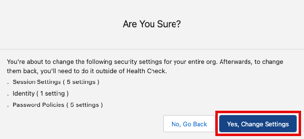
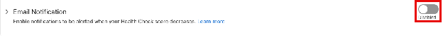
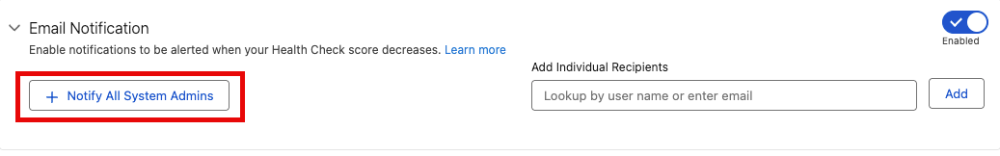
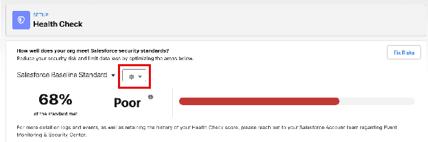
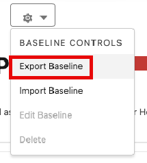
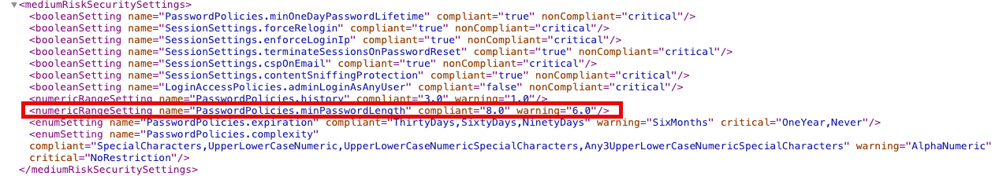
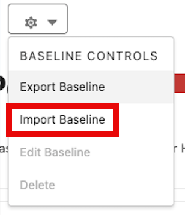
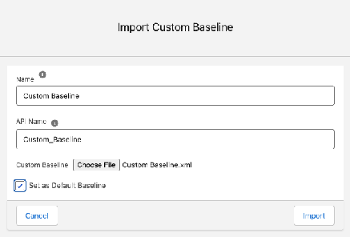

[← Exercise 3: Dive into User Security](05-exercise-3-user-security.md) | [Project Home](../index.md) | [Exercise 5: Fix Remaining Risks (Optional) →](07-exercise-5-fix-remaining-risks-optional.md)

---

# Exercise 4: Configure Health Check

### Scenario

We have manually resolved a few identity, session, and user based security settings, but there is still a lot we can do to increase our security posture. Let's go back to Health Check and fix additional risks, import your own baseline, as well as configure it to notify you of any changes in your Security Score.

### Step 1: Return to Health Check

1. From the Home Page, open Setup.


2. Type Health Check into the Quick Find
3. Select **Health Check**


### Step 2: Update Password Policies

1. Click **Fix Risks**


2. Select the checkbox next to the Password Policies we'd like to update to select additional security risks

| Select These Settings | Status |
| :---- | :---- |
| Require a minimum 1 day password lifetime | Critical |
| Obscure secret answer for password resets | Critical |
| Maximum invalid login attempts | Warning |
| Password complexity requirement | Warning |
| Lockout effective period | Warning |

3. Click **Change Settings**



4. Click **Yes, Change Settings**



Your Security Score and Status in comparison to the Salesforce Baseline Standard have now changed and you have increased your security posture by addressing the risks in your org.

### Step 2: Set Up Email Notifications for Score Changes

1. Scroll down to Email Notification and click the Disabled toggle to set it to Enabled



2. Click **+ Notify All System Admins**



> **Tip:** You can also add additional recipients that you would like to notify when your Security Score changes. Good people to include are members of your IT and Security Teams.

### Step 3: Update the Baseline Standard

The settings in Health Check are in line with the Salesforce Baseline Standard, but some of you might work at organizations with a stricter internal security policy. Let's export the Standard Baseline, make a change to one of our Password Policies, and then upload our new custom baseline to ensure that your score matches your company goals and not just the default ones.

1. Click the Settings dropdown next to Salesforce Baseline Standard to access our Baseline Controls



2. Click **Export Baseline**



> **Tip:** On a Windows machine, open the xml file with Notepad.

> **Tip:** On a Mac, open the xml file with TextEdit. If you are having trouble, you can view the xml in a new browser tab OR you can copy/paste into TextEdit from the Workshop Appendix. To edit, click Format and Make Plain Text.

3. Make the following changes to the Standard Baseline (found in `<mediumRiskSecuritySettings>`)



| Baseline Standard | NEW Standard |
| :---- | :---- |
| compliant="8.0" | compliant="11.0" |

Your xml should now look like this:

```xml
<numericRangeSetting name="PasswordPolicies.minPasswordLength" compliant="11.0" warning="6.0"/>
```

4. Save your xml doc with the title *Custom Baseline.xml*
5. Return to Health Check Baseline Controls


6. Click **Import Baseline**



7. Fill in the following details

| Name | Custom Baseline |
| :---- | :---- |
| API Name | Custom_Baseline |
| Set as Default Baseline | true |

8. Select Choose File and select your *Custom Baseline.xml*



9. Click **Import**

We purposely fixed security settings by group so that we could understand some of the important changes Health Check was going to make. Using the *Fix Risks* tool, you can update multiple (or all) security settings all at once. Health Check is designed to help protect your users and external vectors from having too much or inappropriate access to your system. It does not, however, dig into your data for potential vulnerabilities—so let's look at that next.

### Summary

Health Check is more than just a list of security settings. By setting up notifications when your Security Score changes, and importing a custom baseline, Health Check becomes your risk mitigation dashboard and helps admins shift from being reactive with security concerns to having a proactive security strategy. We did this by configuring Password Policies, exporting the Salesforce Baseline Standard and importing a custom baseline, and setting up notifications when our Security Score changes.

#### Next: Secure your Data with Shield

---

[← Exercise 3: Dive into User Security](05-exercise-3-user-security.md) | [Project Home](../index.md) | [Exercise 5: Fix Remaining Risks (Optional) →](07-exercise-5-fix-remaining-risks-optional.md)
