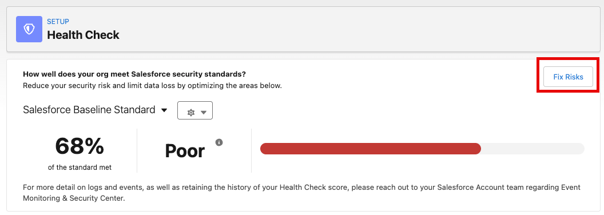
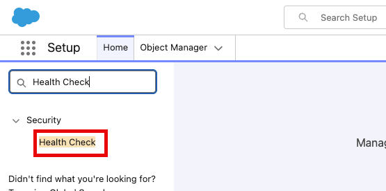
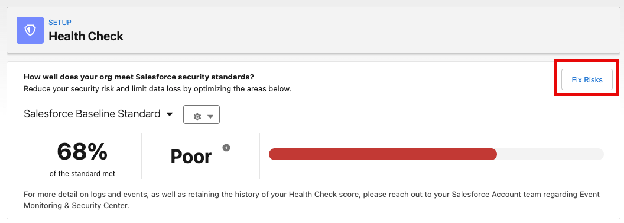
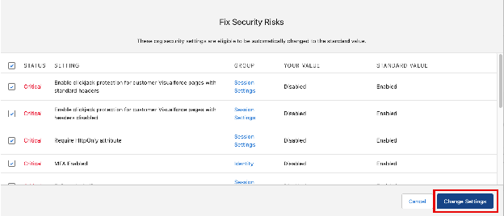
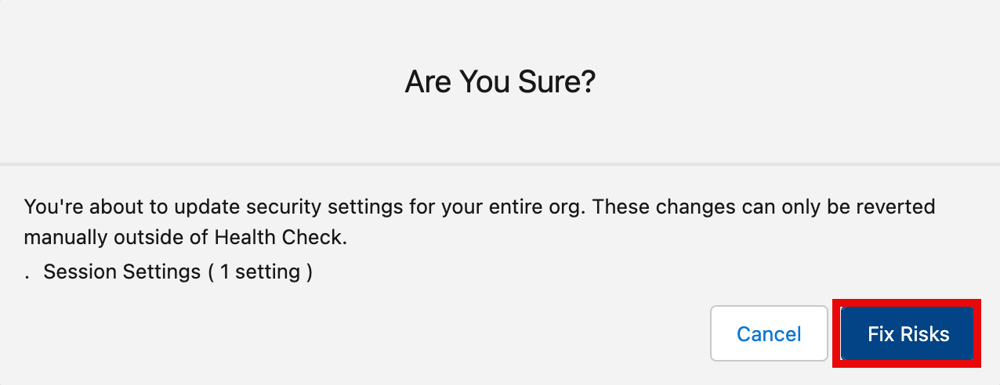

[← Exercise 4: Configure Health Check](06-exercise-4-configure-health-check.md) | [Project Home](../README.md) | [Exercise 6: Secure Your Data with Shield →](08-exercise-6-secure-your-data-with-shield.md)

---

# Exercise 5: Fix Remaining Risks (Optional)

### Scenario

We have manually resolved several of our critical Security Settings and you would now like to fix the remaining risks in bulk.

### Step 1: Return to Health Check

1. From the Home Page, open Setup.

2. Type Health Check into the Quick Find
3. Select **Health Check**

4. Click **Fix Risks**

5. Select the checkbox next to Status to select all remaining settings and click **Change Settings**

6. Click **Yes, Change Settings**

Your Security Score and Status in comparison to your Custom Baseline are now in excellent shape!

---

[← Exercise 4: Configure Health Check](06-exercise-4-configure-health-check.md) | [Project Home](../README.md) | [Exercise 6: Secure Your Data with Shield →](08-exercise-6-secure-your-data-with-shield.md)
