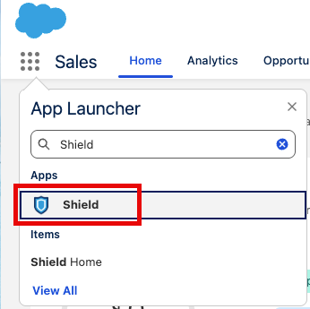
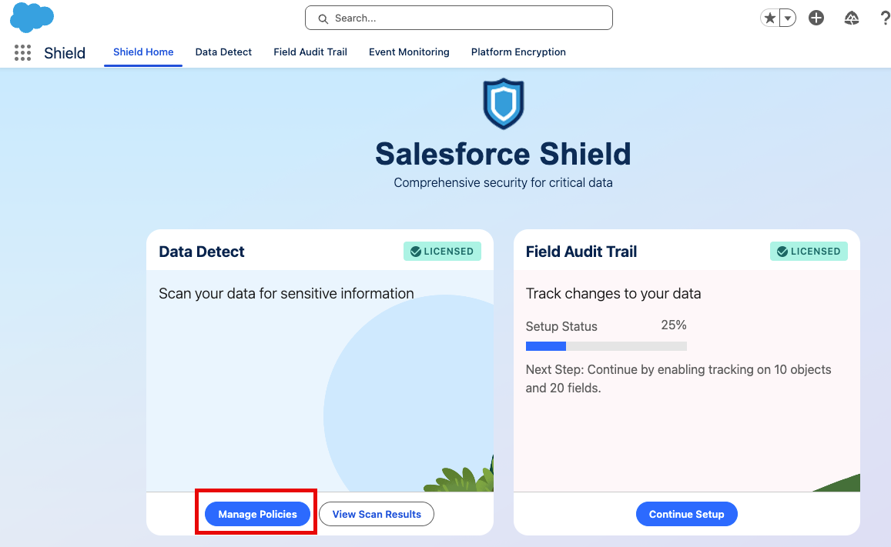
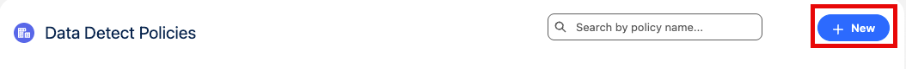
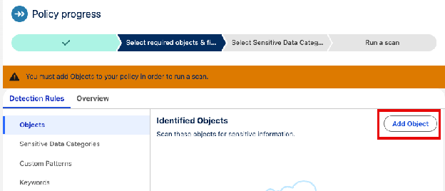
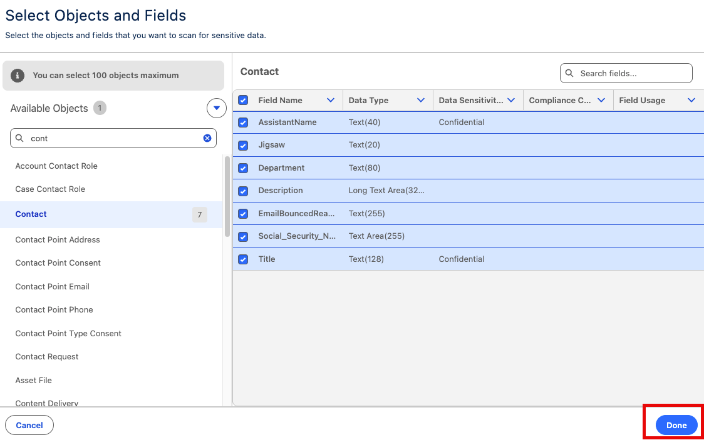
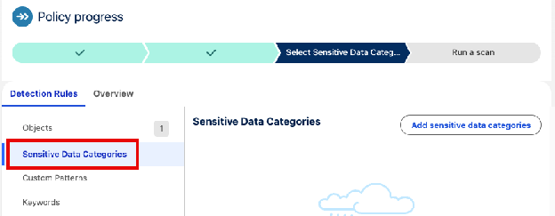
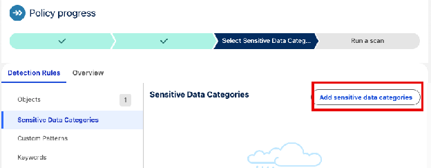
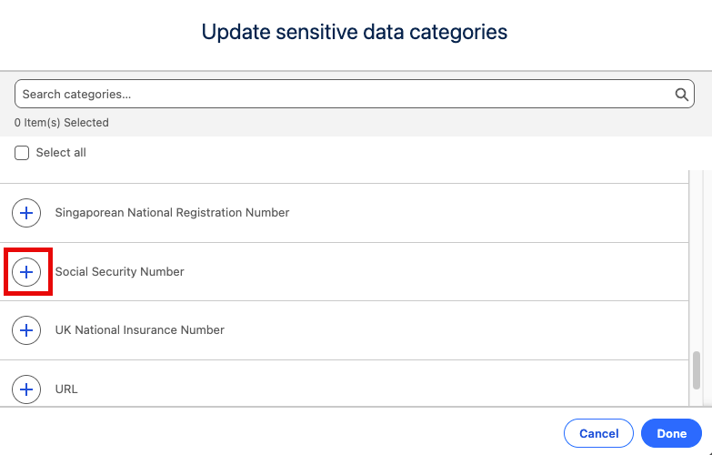
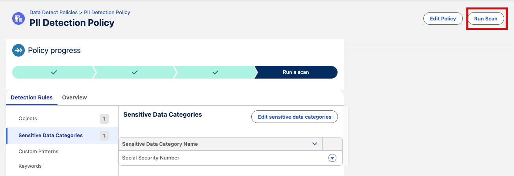
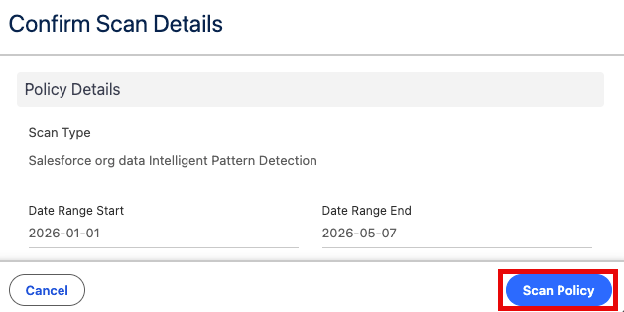

[← Exercise 5: Fix Remaining Risks (Optional)](07-exercise-5-fix-remaining-risks-optional.md) | [Project Home](../index.md) | [Appendix: Standard Baseline XML →](09-appendix-standard-baseline-xml.md)

---

# Exercise 6: Secure Your Data with Shield

### Scenario

Your company is preparing to launch a high-stakes international expansion. This involves handling sensitive metadata, executive contract details, and private financial agreements. Leadership is concerned that over-privileged admins or curious users might access this data undetected, or that sensitive information might be hiding in plain text in unexpected fields.

Admins can secure their Salesforce data with Shield, a suite of add-on products that includes the ability to encrypt data at rest, monitor events including user activity, get a comprehensive audit trail of changes made to your data, and identify sensitive data you may not know exists.

#### PII Information

**PII (Personally Identifiable Information)** is any data point that can be used to uniquely identify, contact, or locate a specific individual. Think of it as a digital fingerprint: it is the data that says, **"This record belongs to this exact person."**

Storing sensitive data such as Social Security numbers or home addresses in Salesforce requires careful access management and strong security controls. If sensitive fields are exposed more broadly than intended, private information could become visible to users who do not need access. As an admin, your goal is to ensure the system captures the information needed for business processes while limiting visibility to only the users who require it.

Some data types carry especially high sensitivity because unauthorized exposure can create immediate privacy, compliance, or fraud risks:

* **Government IDs:** Social Security Numbers (SSNs), driver's license numbers, passport numbers, and Taxpayer IDs.
* **Financial Data:** Credit card numbers, bank account numbers, and debit card details.
* **Contact Info:** Full legal name, home address, and personal cell phone numbers.

### Step 1: Create a Policy in Data Detect

Before you scan your data, you have to know where it is.

1. Open the **App Launcher**
2. Type *Shield* into the search bar

3. Click **Shield**
4. Click **Manage Policies** in the *Data Detect* window

5. Click **New**

6. Enter the following values into your policy

| Field | Value |
| :---- | :---- |
| Policy Name | PII Detection Policy |
| Description | Detect potential PII in standard CRM records |
| Date Range Start | 01/01/2026 |
| Date Range End | (Select Today's Date) |
| Compliance Category to Exclude | PII |

7. Click **Save**
8. Click **Add Object**

9. Select **Contact**
10. Check the box next to all fields
11. Click **Done**

> **Tip:** Select All Fields the first time you're doing a discovery scan, or specific text fields where you suspect SSNs might be hiding (some common examples include *Description*, or custom text fields).

12. Click Sensitive **Data Categories**

13. Click **Add sensitive data categories**

14. Click **+** next to the following fields:

| Credit Card Number |
| :---- |
| Social Security Number |

15. Click **Done**

### Step 2: Find the Risk Using Data Detect

1. Click **Run Scan**

2. Click Scan Policy

> **Tip:** Your scan will enter a queue. Move onto the next step—you can come back and check your scan status later by opening *Data Detect* and selecting **View Scan Results**.

Now that Data Detect has flagged the sensitive fields, you need to ensure that even if the underlying database were compromised, the data remains unreadable.

### Summary

In this exercise, you used Salesforce Shield's Data Detect capabilities to proactively scan your org for sensitive data, including personally identifiable information (PII) that may be stored in unexpected places. Identifying these risks is the first step toward securing sensitive data through stronger monitoring, access controls, and encryption.

While other Shield tools focus on protecting or monitoring data, Data Detect is about discovery. It tells you where the "secret" data is actually hiding so you don't have to guess. For an admin, managing a large Salesforce org can feel like trying to organize a library where people keep scribbling secrets in the margins of random books—Data Detect helps you regain control.

> **Further Reading:** [Experience Cloud Security](13-further-reading-experience-cloud.md)

---

[← Exercise 5: Fix Remaining Risks (Optional)](07-exercise-5-fix-remaining-risks-optional.md) | [Project Home](../index.md) | [Appendix: Standard Baseline XML →](09-appendix-standard-baseline-xml.md)
